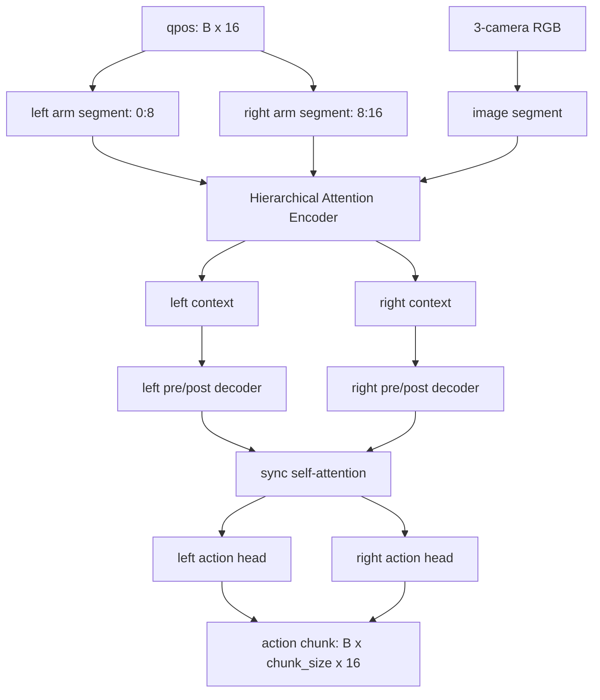

<div align="center">

# Hierarchically Decoupled InterACT Imitation Learning for Bimanual Robots

### A TronCamp Mani T1-T4 Bimanual Manipulation Project

Built on RoboTwin bimanual simulation, this project covers expert trajectory collection, ACT official-submission training, local evaluation, visual rollout demos, and an InterACT-style research branch for hierarchical bimanual coordination.


[视频展示](#视频展示) · [官方 ACT 提交复现](#官方-act-提交复现) · [InterACT 算法](#interact-算法) · [复现指南](docs/reproduce.md) · [详细记录](records)

</div>

## 项目概览

这个项目围绕 TronCamp Mani 四个机器人操作任务展开，目标不是只做单个 demo，而是搭建一条可以持续推进 T1-T4 的模仿学习实验流水线。

当前已经完成：

- T1 `adjust_bottle`：数据采集、ACT 训练、本地评估、策略部署演示和官方提交。
- T2 `grab_roller`：600 条成功轨迹采集、ACT + 轻量视觉增强训练、本地公开 seed 评估和官方提交。
- T3 `stack_bowls_two`：600 条成功轨迹采集、ACT 训练和公开 seed 全量评估。
- T4 `stack_bowls_three`：600 条成功轨迹采集、ACT 快速训练、策略 rollout 演示和官方提交。
- InterACT：新增独立算法目录，作为复杂双臂长序列任务的研究改进分支，不作为官方提交结果宣称。

## 视频展示

以下视频作为 InterACT 复现实验的策略闭环展示，用于呈现分层双臂策略在 T1-T4 任务上的执行效果；线上排行榜提交结果见后文的官方 ACT 提交流程。

<table>
  <tr>
    <td width="25%" align="center">
      <h3>T1：InterACT 复现闭环执行</h3>
      
      <br />
      <a href="media/t1_policy_rollout_success_seed_20260631.mp4">查看原始 MP4</a>
    </td>
    <td width="25%" align="center">
      <h3>T2：InterACT 复现抓举滚筒</h3>
      
      <br />
      <a href="media/t2_policy_rollout_success_seed_20260630.mp4">查看原始 MP4</a>
    </td>
    <td width="25%" align="center">
      <h3>T3：InterACT 复现叠两碗</h3>
      
      <br />
      <a href="media/t3_policy_rollout_success_seed_20260629.mp4">查看原始 MP4</a>
    </td>
    <td width="25%" align="center">
      <h3>T4：InterACT 复现叠三碗</h3>
      
      <br />
      <a href="media/t4_policy_rollout_seed_20260629.mp4">查看原始 MP4</a>
    </td>
  </tr>
</table>

## 当前进度

| 阶段 | 任务 | 当前状态 |
|---|---|---|
| T1 | `adjust_bottle` | 已完成数据采集、ACT 训练、本地评估、策略部署演示和官方提交 |
| T2 | `grab_roller` | 600 条轨迹，增强训练版 ACT 完成训练与官方提交 |
| T3 | `stack_bowls_two` | 600 条轨迹，ACT 本地公开 seed `72%` |
| T4 | `stack_bowls_three` | 600 条轨迹，ACT 快速训练完成，最佳验证损失 `0.036161 @ epoch 1100`，官方提交 `#695` |
| InterACT | `stack_bowls_three` | 独立实验分支，已接入同一批 processed data，用于和 ACT 结果做结构对照 |

## 项目亮点

| 方向 | 内容 |
|---|---|
| 完整流程 | 打通 RoboTwin 任务配置、专家轨迹采集、ACT 数据处理、训练、评估和展示 |
| 双臂任务 | 从 T1 单任务流程推进到 T2 抓举滚筒、T3 双碗堆叠和 T4 三碗堆叠 |
| 算法扩展 | 在官方 ACT 提交流程旁新增 `policies/inter-act/`，围绕 InterACT 风格结构做双臂协同建模 |
| 工程整理 | 训练产物、checkpoint、HDF5 数据和 token 不入库，GitHub 保留可展示代码和记录 |
| 可复现性 | 提供从环境安装到训练评估的 [复现指南](docs/reproduce.md) |

## InterACT 算法

InterACT 是本项目的研究改进分支，目标是验证分层解耦结构是否更适合 T3/T4 这类长序列双臂任务。官方线上提交仍使用 ACT checkpoint 和官方 ACT 推理接口，InterACT 不作为官方提交成绩宣称。

```text
policies/inter-act/
```

InterACT 分支复用官方 ACT 的 HDF5 数据格式、三相机 RGB 输入和 16 维双臂动作接口，但把“左臂、右臂、图像”拆成结构化 segment，并显式建模双臂同步。

### 架构摘要



输入输出保持和 ACT 数据接口对齐：

```text
qpos:        [B, 16]
image:       [B, 3, 3, 480, 640]
action:      [B, T, 16]
prediction:  [B, chunk_size, 16]
```

Tron2 的 16 维动作被拆成左右臂：

```text
left arm + left gripper:   action[0:8]
right arm + right gripper: action[8:16]
```

### 核心模块

| 模块 | 作用 |
|---|---|
| Arm segment | 为左右臂分别构造 CLS tokens 和 joint tokens，显式保留双臂结构 |
| Image segment | 三路 RGB 相机经过 ResNet18 backbone，并加入 camera embedding |
| Hierarchical Attention Encoder | 先做 segment 内 attention，再用 CLS tokens 做跨 segment 信息交换 |
| Multi-Arm Decoder | 左右臂分别解码，中间通过 sync self-attention 做动作计划同步 |
| Action heads | 输出左右臂动作后拼回 16 维 action chunk |

### 核心差异

| 对比项 | ACT 官方提交流程 | InterACT 研究分支 |
|---|---|---|
| 数据接口 | HDF5 + 三相机 RGB + qpos | 保持一致 |
| 动作维度 | 16 维整体建模 | 拆成 left/right 两个 8 维分支 |
| 主干结构 | ACT CVAE Transformer | HAE + Multi-Arm Decoder |
| 双臂协同 | 由 Transformer 隐式学习 | 通过 segment 和 sync attention 显式建模 |
| loss | L1 + KL | masked L1 |
| checkpoint | `act_ckpt/` | `inter_act_ckpt/` |

当前 InterACT 第一版先保持 RGB 输入，不加入点云、SAC/PPO residual 或额外 RL 后训练，目的是先验证结构本身是否能适配现有 ACT 数据集和训练框架。

详细说明见 [docs/interact_design.md](docs/interact_design.md)。

## 技术路线

```text
RoboTwin T1-T4 双臂操作任务
        |
        v
任务配置与专家轨迹采集
        |
        v
ACT 数据预处理
        |
        v
策略训练与 checkpoint 选择
        |
        v
公开 seed 本地评估
        |
        v
成功示例录制与提交复盘
```

主要技术栈：

- Python / PyTorch
- Action chunking imitation learning
- InterACT-style hierarchical attention
- RoboTwin 双臂机器人仿真
- CUDA 单卡训练与评估
- GitHub 项目记录与视频展示

## 如何复现

完整复现步骤见 [docs/reproduce.md](docs/reproduce.md)。

## 官方 ACT 提交复现

线上排行榜成绩使用 ACT 提交流程复现。InterACT 代码用于研究对照，不参与官方提交包。

1. 准备官方 RoboTwin 运行环境：

```text
external/robotwin_local/
```

2. 安装环境：

```bash
make check
make env
make install
```

3. 采集、处理、训练指定赛道：

```bash
make collect TRACK=T4 GPU=0
PROCESS_RESUME=1 PROCESS_DELETE_SOURCE=1 make process TRACK=T4
make train TRACK=T4 SEED=0 GPU=0
```

4. 本地评估：

```bash
make eval-local TRACK=T4
```

5. 提交官方测评：

```bash
export TRONCAMP_TOKEN_FILE=/path/to/token.txt
make submit TRACK=T4
```

注意：提交时 checkpoint 结构必须和 `policy/ACT/deploy_policy.yml` 或对应 deploy config 完全一致，尤其是 `hidden_dim`、`chunk_size`、`dim_feedforward`、相机顺序和 `policy_class`。

公开仓库不包含本地完整 RoboTwin 运行环境、采集数据和 checkpoint。复现前需要把官方 starter package 中的 `robotwin_local` 放到：

```text
external/robotwin_local/
```

最常用入口：

```bash
make check
make env
make install
make collect TRACK=T1 GPU=0
make process TRACK=T1
make train TRACK=T1 SEED=0 GPU=0
make eval-local TRACK=T1
```

T2 使用：

```bash
make collect TRACK=T2 GPU=0
make process TRACK=T2
make train TRACK=T2 SEED=0 GPU=0
make eval-local TRACK=T2
```

T3 使用：

```bash
make collect TRACK=T3 GPU=0
make process TRACK=T3
make train TRACK=T3 SEED=0 GPU=0
python starter/eval_local.py --track T3 \
  --ckpt-dir external/robotwin_local/policy/ACT/act_ckpt/act-stack_bowls_two/stack_bowls_two_600ep-600 \
  --deploy-config policy/ACT/deploy_t3.yml
```

T4 使用：

```bash
make collect TRACK=T4 GPU=0
PROCESS_RESUME=1 PROCESS_DELETE_SOURCE=1 make process TRACK=T4
make train TRACK=T4 SEED=0 GPU=0
TRONCAMP_TOKEN_FILE=/path/to/token.txt make submit TRACK=T4
```

## 仓库结构

```text
records/
  t1_record.md             # T1 阶段记录
  t2_record.md             # T2 阶段记录
  t3_record.md             # T3 阶段记录
  t4_record.md             # T4 阶段记录
  t1_public_eval.json      # T1 本地评估结果归档
  t2_public_eval.json      # T2 最新本地评估结果归档
  t3_public_eval.json      # T3 本地评估结果归档
media/
  t1_policy_rollout_success_seed_20260631.gif
  t1_policy_rollout_success_seed_20260631.mp4
  t2_policy_rollout_success_seed_20260630.gif
  t2_policy_rollout_success_seed_20260630.mp4
  t3_policy_rollout_success_seed_20260629.gif
  t3_policy_rollout_success_seed_20260629.mp4
  t4_policy_rollout_seed_20260629.gif
  t4_policy_rollout_seed_20260629.mp4
policies/
  inter-act/               # 独立 InterACT 风格算法改造
docs/
  interact_design.md       # InterACT 架构说明
  reproduce.md             # 从环境安装到训练评估的复现步骤
recipes/
  eval/                    # 本地评估相关脚本
  train/                   # ACT 训练相关脚本
scripts/                   # 一键采集、处理、训练、评估、提交入口
starter/                   # 本地评估和可视化入口
submit/                    # 官方提交脚本
```

## 不包含的内容

公开仓库不包含：

- 采集得到的 `.hdf5` 演示数据
- ACT processed data
- `.ckpt` checkpoint
- 本地训练/评估日志
- 官方提交 token 或其他凭据
- 本地完整 RoboTwin 运行环境副本

## 后续计划

- 继续整理 T1-T4 训练曲线、提交结果和失败案例复盘。
- 在更长序列任务上对比 ACT、ACT + 数据增强、InterACT 三组策略。
- 验证更强视觉编码器、temporal aggregation 和更稳定的 checkpoint 选择策略。
- 将当前脚本沉淀为更干净的一键实验入口。
