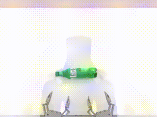
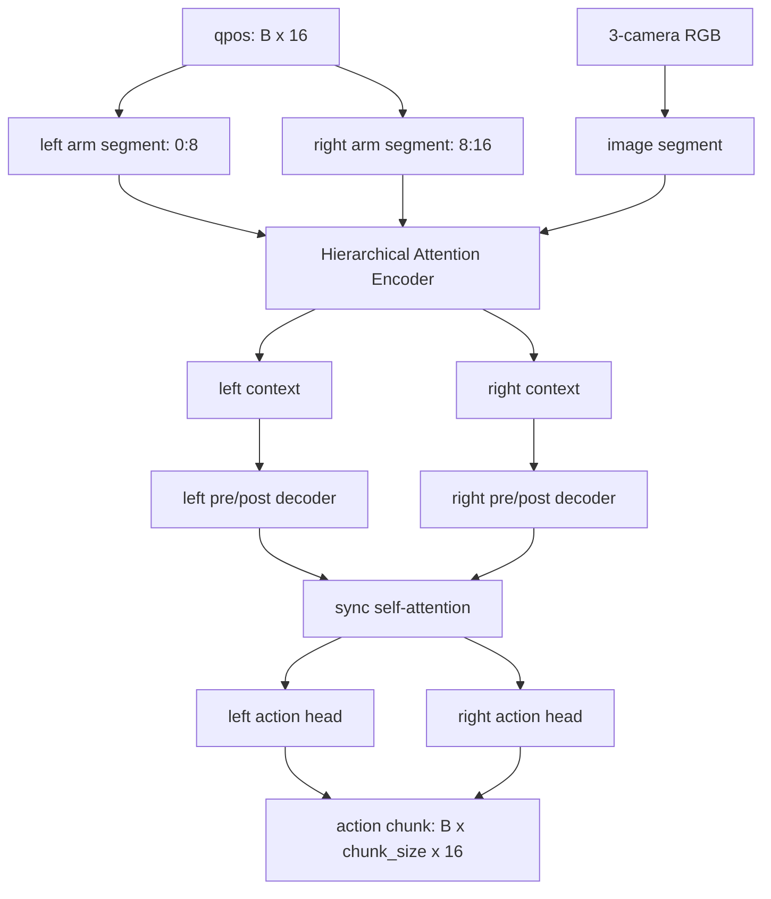

<div align="center">

# Hierarchically Decoupled ACT Imitation Learning for Bimanual Robots

### A TronCamp Mani T1-T4 Bimanual Manipulation Project

Built on RoboTwin bimanual simulation, this project covers expert trajectory collection, ACT policy training, local evaluation, visual rollout demos, and an InterACT-style hierarchical decoupled policy branch for bimanual coordination.


[视频展示](#视频展示) · [InterACT 改造](#interact-算法改造) · [复现指南](docs/reproduce.md) · [详细记录](records)

</div>

## 项目概览

这个项目围绕 TronCamp Mani 四个机器人操作任务展开，目标不是只做单个 demo，而是搭建一条可以持续推进 T1-T4 的模仿学习实验流水线。

当前已经完成：

- T1 `adjust_bottle`：数据采集、ACT 训练、本地评估、策略部署演示和官方提交。
- T2 `grab_roller`：400 条成功轨迹采集、ACT baseline 训练和成功示例展示。
- InterACT：在 ACT baseline 旁新增独立算法目录，用于后续 T3/T4 双臂长序列任务验证。

## 视频展示

<table>
  <tr>
    <td width="50%" align="center">
      <h3>T1：ACT 策略闭环执行</h3>
      
      <br />
      <a href="media/t1_policy_rollout_success_seed_20260631.mp4">查看原始 MP4</a>
    </td>
    <td width="50%" align="center">
      <h3>T2：双臂抓举滚筒成功示例</h3>
      
      <br />
      <a href="media/t2_collect_success_grab_roller_episode1.mp4">查看原始 MP4</a>
    </td>
  </tr>
</table>

## 当前进度

| 阶段 | 任务 | 当前状态 |
|---|---|---|
| T1 | `adjust_bottle` | 已完成数据采集、ACT 训练、本地评估、策略部署演示和官方提交 |
| T2 | `grab_roller` | 已完成 400 条成功轨迹采集、ACT baseline 训练和成功示例展示 |
| T3 | `stack_bowls_two` | 准备中 |
| T4 | `stack_bowls_three` | 准备中，后续作为综合任务重点验证 |

## 项目亮点

| 方向 | 内容 |
|---|---|
| 完整流程 | 打通 RoboTwin 任务配置、专家轨迹采集、ACT 数据处理、训练、评估和展示 |
| 双臂任务 | 从 T1 单任务流程推进到 T2 双臂协同抓举任务 |
| 算法扩展 | 新增 `policies/inter-act/`，保留 ACT baseline，同时准备 InterACT 风格结构 |
| 工程整理 | 训练产物、checkpoint、HDF5 数据和 token 不入库，GitHub 保留可展示代码和记录 |
| 可复现性 | 提供从环境安装到训练评估的 [复现指南](docs/reproduce.md) |

## InterACT 算法改造

本项目没有直接覆盖原 ACT，而是在旁边新增独立目录：

```text
policies/inter-act/
```

InterACT 分支继续复用当前 ACT 的 HDF5 数据格式、三相机 RGB 输入和 16 维双臂动作接口，但把“左臂、右臂、图像”拆成结构化 segment，并显式建模双臂同步。

### 架构摘要



输入输出保持和 ACT 对齐：

```text
qpos:        [B, 16]
image:       [B, 3, 3, 480, 640]
action:      [B, T, 16]
prediction:  [B, chunk_size, 16]
```

Tron2 的 16 维动作被拆成左右臂：

```text
left arm + left gripper:   action[0:8]
right arm + right gripper: action[8:16]
```

### 核心模块

| 模块 | 作用 |
|---|---|
| Arm segment | 为左右臂分别构造 CLS tokens 和 joint tokens，显式保留双臂结构 |
| Image segment | 三路 RGB 相机经过 ResNet18 backbone，并加入 camera embedding |
| Hierarchical Attention Encoder | 先做 segment 内 attention，再用 CLS tokens 做跨 segment 信息交换 |
| Multi-Arm Decoder | 左右臂分别解码，中间通过 sync self-attention 做动作计划同步 |
| Action heads | 输出左右臂动作后拼回 16 维 action chunk |

### 和 ACT Baseline 的区别

| 对比项 | ACT baseline | InterACT 分支 |
|---|---|---|
| 数据接口 | HDF5 + 三相机 RGB + qpos | 保持一致 |
| 动作维度 | 16 维整体建模 | 拆成 left/right 两个 8 维分支 |
| 主干结构 | ACT CVAE Transformer | HAE + Multi-Arm Decoder |
| 双臂协同 | 由 Transformer 隐式学习 | 通过 segment 和 sync attention 显式建模 |
| loss | L1 + KL | masked L1 |
| checkpoint | `act_ckpt/` | `inter_act_ckpt/` |

当前 InterACT 第一版先保持 RGB 输入，不加入点云、SAC/PPO residual 或额外 RL 后训练，目的是先验证结构本身是否能适配现有 ACT 数据集和训练框架。

详细说明见 [docs/interact_design.md](docs/interact_design.md)。

## 技术路线

```text
RoboTwin T1-T4 双臂操作任务
        |
        v
任务配置与专家轨迹采集
        |
        v
ACT / InterACT 数据预处理
        |
        v
策略训练与 checkpoint 选择
        |
        v
公开 seed 本地评估
        |
        v
成功示例录制与提交复盘
```

主要技术栈：

- Python / PyTorch
- ACT imitation learning
- InterACT-style hierarchical attention
- RoboTwin 双臂机器人仿真
- CUDA 单卡训练与评估
- GitHub 项目记录与视频展示

## 如何复现

完整复现步骤见 [docs/reproduce.md](docs/reproduce.md)。

公开仓库不包含本地完整 RoboTwin 运行环境、采集数据和 checkpoint。复现前需要把官方 starter package 中的 `robotwin_local` 放到：

```text
external/robotwin_local/
```

最常用入口：

```bash
make check
make env
make install
make collect TRACK=T1 GPU=0
make process TRACK=T1
make train TRACK=T1 SEED=0 GPU=0
make eval-local TRACK=T1
```

T2 使用：

```bash
make collect TRACK=T2 GPU=0
make process TRACK=T2
make train TRACK=T2 SEED=0 GPU=0
make eval-local TRACK=T2
```

## 仓库结构

```text
records/
  t1_record.md             # T1 阶段记录
  t2_record.md             # T2 阶段记录
  t1_public_eval.json      # T1 本地评估结果归档
media/
  t1_policy_rollout_success_seed_20260631.gif
  t1_policy_rollout_success_seed_20260631.mp4
  t1_collect_demo_episode43.gif
  t1_collect_demo_episode43.mp4
  t2_collect_success_grab_roller_episode1.gif
  t2_collect_success_grab_roller_episode1.mp4
policies/
  inter-act/               # 独立 InterACT 风格算法改造
docs/
  interact_design.md       # InterACT 架构说明
  reproduce.md             # 从环境安装到训练评估的复现步骤
recipes/
  eval/                    # 本地评估相关脚本
  train/                   # ACT 训练相关脚本
scripts/                   # 一键采集、处理、训练、评估、提交入口
starter/                   # 本地评估和可视化入口
submit/                    # 官方提交脚本
```

## 不包含的内容

公开仓库不包含：

- 采集得到的 `.hdf5` 演示数据
- ACT processed data
- `.ckpt` checkpoint
- 本地训练/评估日志
- 官方提交 token 或其他凭据
- 本地完整 RoboTwin 运行环境副本

## 后续计划

- 补充 T2 policy rollout 视频。
- 推进 T3/T4 长序列双臂协同任务。
- 对比 ACT、ACT + 数据增强、InterACT 三组策略。
- 继续整理可展示的视频、训练记录和阶段成果。
